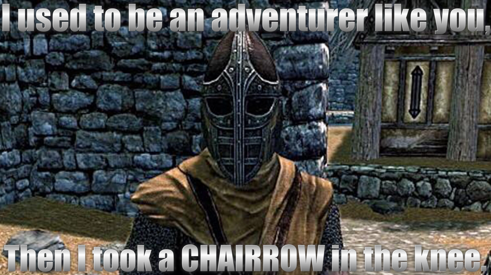

# Chairrows (Chair Arrows)

A Skyrim Special Edition mod By Mark E. Kraus.

My mods:

* [Chairrows - Chair Arrows](https://www.nexusmods.com/skyrimspecialedition/mods/61168)
* [Cheat Jewelry](https://www.nexusmods.com/skyrimspecialedition/mods/58973)
* [Cheat Powers](https://www.nexusmods.com/skyrimspecialedition/mods/58892)
* [Exit Combat Power](https://www.nexusmods.com/skyrimspecialedition/mods/58651)
* [Sentient Chairs of Skyrim (SCOS)](https://www.nexusmods.com/skyrimspecialedition/mods/59604)

## About Chairrows (Chair Arrows)

This mod adds several Chair Arrows to the game.

## Features

### Chairrows

Each Chairrow is made to correspond to an equivalent vanilla arrow.

* Iron Chairrow (similar to Iron Arrow)
* Steel Chairrow (similar to Steel Arrow)
* Orcish Chairrow (similar to Orcish Arrow)
* Dwarven Chairrow (similar to Dwarven Arrow)
* Elven Chairrow (similar to Elven Arrow)
* Glass Chairrow (similar to Glass Arrow)
* Ebony Chairrow (similar to Ebony Arrow)
* Daedric Chairrow (similar to Daedric Arrow)

## Installation

### Requirements

This mod requires [SKSE](https://skse.silverlock.org/)

### Recommended

[Static Mesh Improvement Mod - SMIM](https://www.nexusmods.com/skyrimspecialedition/mods/659). Will improve the looks of Chairrows.

### NMM/Vortex

Download and install with Vortex and the FOMOD installer will take care of the rest.

### Manual

* Extract the 7z file using 7-Zip.
* Copy the extracted `Chairrows.esp` and `Chairrows.bsa` files to the `data` folder under your Skyrim: Special Edition installation folder.
* Enable the plugin using whatever method you usually use.

### Load Order

This mod can be installed in any order.

## User Guide

Chairrows can be crafted at a blacksmith's forge using the same materials as normal arrows of the same type. Chairrows are equipped like normal arrows and can be fired the sae as well.

Chairrows can also be bought from general goods vendors, blacksmiths, and any other vendors that normally sell arrows.

Enemies may also be armed with chairrows. They may attack you with them or you may find them on their dead bodies.

## Jank Warning

The way Skyrim does arrow and quiver meshes causes the chair ammo to look really weird on your player character or NPCs. I've tried dozens of ways to get around this but it's just not possible without changing the default skeleton everything uses or making the chair take up a ton of the screen when shooting in 1st person mode.

This is just a visual oddity. It has no impact on game play.

## Compatibility

This mod should be compatible with everything.

This mod has scripted compatibility with [Valdacil's Item Sorting](https://www.nexusmods.com/skyrimspecialedition/mods/5224). No patch is required.

## Warning: Not Lore-Friendly and Swearing

This mod is technically not lore-friendly because shooting chairs is silly.
